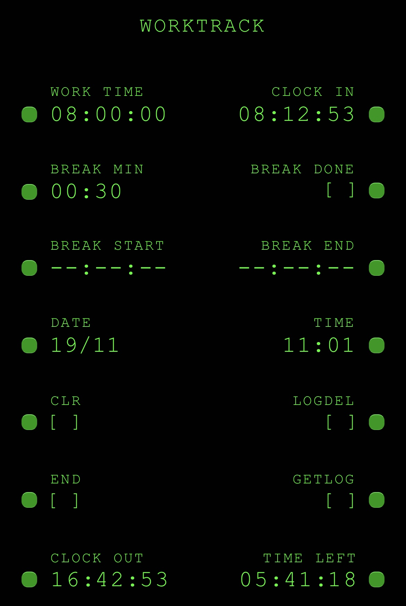

# WorkTrack

This is the mobile PWA version of [**WorkTrack**](https://github.com/4l3b/WorkTrack), a browser-based tool for recording daily work sessions.

---

## Features

- Log clock-in time, expected work duration, and expected break duration
- Calculates:
  - Expected clock-out time
  - Remaining time in the workday
- Adjusts calculations if:
  - A session ends early
  - Work continues into overtime
- Stores session data locally, so it persists across page reloads
- JSON export/import:
  - Download a log of your work history
  - Upload a previous log
  - Clear stored data
- Cockpit-style UI modeled after the Flight Management Computer of the iconic McDonnell Douglas MD-11 aircraft

---

## Tech Stack

- **HTML**: Structure
- **CSS**: Styling
- **JavaScript**: Time calculations, data storage, and JSON export/import

---

## Usage

Go to the [GitHub Pages site](https://4l3b.github.io/WorkTrack_pwa/) on your mobile device and save the page to your home screen for quick access and offline use. Instructions for usage are available within the interface by clicking on the app's title.

---

WorkTrack © 2025 by Alessandro Bigolin - [CC BY-NC-SA 4.0].

See LICENSE file: [https://github.com/4l3b/WorkTrack_pwa/blob/main/LICENSE].
